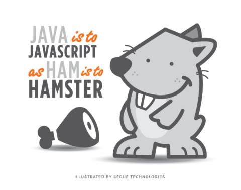

Java was my first ever exposure to coding. In the beginning it was very intimidating since enrolling in ICS 111, I knew some classmates who had previous coding backgrounds. Learning that some of classmates had previous coding backgrounds made me feel inferior. Thankfully the professor I had was very open towards those with little to no knowledge at all about coding. He was able to explain many concepts in the simplist of detail for me to understand the material.

I began to become confident in understanding how to type in Java after multiple completed projects during my ICS 111 course. However, it came with a lot of mistakes to get there. Simiplist of mistakes such as syntax errors by forgetting the semicolons and prentices to long debugging sessions from logical error in algorithms. These mistakes had shaped me to become a better coder after learning my short commings and have high respect towards the Java language since you could say was "my first love".



As of Spring semester of 2019 I had enrolled in ICS 314 which revolved around learning Javascript. Leading up to the days of the course I had thought Javascript was going to be similar to Java. It is quite similar, however, they are very different. While learning Javascript I had made multiple mistakes because of the muscle memory I had achieved from a year of learning Java. The concept of using let and const when declaring variables instead of the data type was a leading cause. As well as creating functions in Java specifying static, return type, and parameter data types is very differnt to Javascript in being very minimal.

```
// Java
public static void function1(int a) {
  ...
}

// Javascript
function function1(a) {
  ...
}
```

For as little information I have so far on Javascript I can still see the potential it has over the other languages I learned. With how minimal each line of code it can become it will be very easy to write an equal amount of code in Java in less time using Javascript. However, it doesn't lead to Javascript being the best over all other languages. Java is great for user interfaces but lacks in speed while C/C++ being great with computation but is very complex. I believe Javascript will also be under similar circumstances as Java and C/C++.
