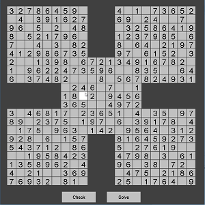

My group’s project for ICS 111 had to develop a program in which incorporates code that we had learned so far. My group was very ambitious to create a complex algorithm and the first thing that came into mind was creating a puzzle solver and decided to go with sudoku puzzles. Our group didn’t just end it there, we had also decided to have our program to be played in which the user can manually input their own puzzle and play it on our program. We also incorporated a samurai mode in which creates a samurai sudoku puzzle instead of a regular sudoku puzzle you would normally see; samurai sudoku puzzles consist of five individual sudoku puzzles overlapping one another.

This project was also when I learned about using GitHub. Since my group had varying schedules one of my group members had subjection that GitHub would be great for our scenario. It was very useful when dealing with creating the solving algorithms and all the features we wanted our project to have within our deadlines. GitHub was a way for us to work on different parts of the program without actually meeting up to get one another’s code.
